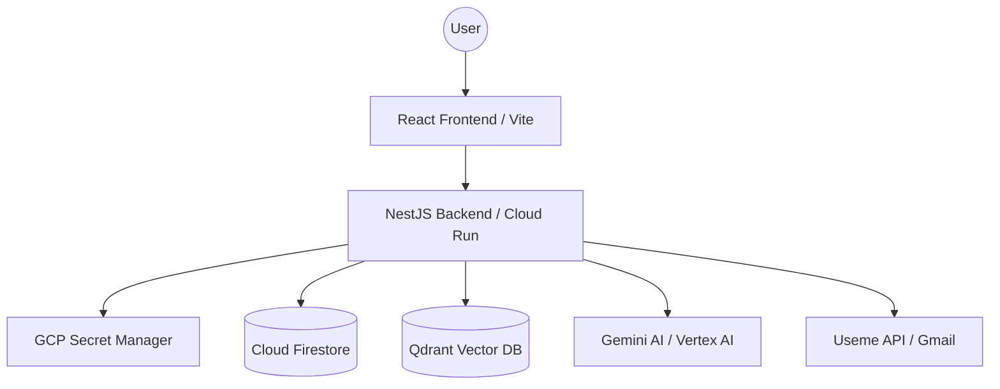

# Advanced AI Portfolio & Automation Hub

[](https://ks-infra.dev/health)
[](https://en.wikipedia.org/wiki/Hexagonal_architecture_(software))
[](https://cloud.google.com/)

A high-performance, enterprise-grade portfolio system built with **NestJS**, **React**, and **Google Cloud Platform**. This repository isn't just a website—it's a production-ready demonstration of Modern Software Engineering, AI/LLM integration (RAG), and Cloud-Native Infrastructure.

---

## 🏗️ Architectural Excellence

The project strictly follows **Clean Architecture** and **Hexagonal (Ports & Adapters) principles**, ensuring that the business logic is entirely decoupled from external infrastructure (Databases, AI Models, APIs).

- **Domain Layer**: Pure business logic and entities (e.g., `JobOffer`, `Knowledge`).
- **Application Layer**: Use cases coordinating data flow (e.g., `ProcessNewOffers`, `GenerateChatResponse`).
- **Infrastructure Layer**: Technical implementations (e.g., `GmailAdapter`, `VertexAiAdapter`, `FirestoreRepository`).

### System Overview


---

## 🚀 Key Features

### 🤖 AI-Powered RAG (Retrieval-Augmented Generation)
- **Knowledge Lab**: Interactive chat system that uses Gemini 2.5 Flash lite to answer questions based on my CV and projects.
- **Vector Search**: High-speed retrieval using **Qdrant** and Google Embeddings for context-aware responses.
- **Document Analysis**: Automated PDF parsing and knowledge extraction.

### 💼 Smart Useme Automation
- **Autonomous Scraper**: Automated Gmail polling via Google OAuth2 to find new job offers.
- **AI Triage**: Gemini evaluates job offers against my `USEME_USER_SKILLS` profile and assigns a "Suitability Score".
- **Slack Integration**: Instant notifications for high-matching opportunities.

### 🛠️ SRE & Infrastructure as Code (IaC)
- **Terraform Managed**: Full GCP infrastructure defined as code in a separate repository.
- **GitOps CI/CD**: Automated deployments via GitHub Actions to Google Cloud Run.
- **Observability**: Integrated with **Prometheus**, **Loki**, and **Grafana** for deep telemetry and logging.
- **Security**: Strict CORS, Helmet, and Secret Manager integration for enterprise-level security.

---

## 🛠️ Technology Stack

| Category | Tools |
| :--- | :--- |
| **Backend** | NestJS (Node.js), TypeScript, RxJS, Pino-Logger |
| **Frontend** | React, Vite, Framer Motion, GSAP, Tailwind CSS |
| **Cloud/Infra** | GCP (Cloud Run, Cloud Scheduler, Secret Manager, Firestore) |
| **DevOps** | Terraform, GitHub Actions, Docker, Helm |
| **AI/ML** | Google Gemini (Vertex AI), Qdrant (Vector DB), MLOps |
| **Monitoring** | Prometheus, Grafana, Loki |

---

## 🚦 Getting Started

### Prerequisites
- Node.js 20+
- Google Cloud SDK
- Terraform (for infrastructure)

### Local Development
```bash
# Clone the repository
git clone https://github.com/halo2008/portfolio.git

# Install dependencies
npm install

# Set up environment variables (.env)
cp .env.example .env

# Start development server
npm run start:dev
```

---

## 🛡️ Security & Performance
- **Zero-Trust**: All keys managed via Secret Manager; no secrets in the repository.
- **Optimized**: Dockerized multi-stage builds for minimal image size.
- **Resilient**: Custom Startup/Liveness probes and automated horizontal scaling.

---

## 👨‍💻 Author
**Senior SRE & Infrastructure Architect**
Specializing in GKE, MLOps, and Intelligent Automation.

[Portfolio Site](https://ks-infra.dev) | [LinkedIn](https://www.linkedin.com/in/konrad-s%C4%99dkowski-329644176/)
